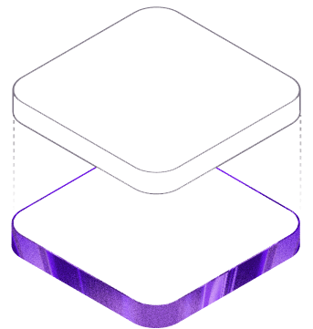

# Franchise Territory Map

> **Live demo:** [nich9000.github.io/franchise-territory-map](https://nich9000.github.io/franchise-territory-map/)

Interactive territory analysis for franchise expansion. Drop a pin on any U.S. address, pull real Census demographics for the neighborhood, see existing competitor density, and get an instant pass/fail against your franchise's viability rules.

Originally prototyped in Google Antigravity to evaluate Club Pilates territory requirements, then generalized so any franchise concept can be modeled by editing a single presets file.



## What it does

- **Drop a pin** anywhere in the U.S. and the app pulls every Census Tract intersecting your radius and renders the actual tract boundaries.
- **Live demographic aggregation** — total population (`B01003_001E`) and average median household income (`B19013_001E`) summed/averaged across all intersecting tracts via the U.S. Census ACS 5-Year API.
- **Real competitor overlay** — pulls existing pilates studios, fitness centers, and cafés from OpenStreetMap (Overpass API) within ~15 mi for context.
- **Pass / fail viability** — compares aggregated demographics against the active preset's minimum population and income thresholds.
- **Configurable franchise concepts** — pick Club Pilates, Orangetheory, Anytime Fitness, Starbucks, or define your own thresholds. Switching presets re-evaluates the same neighborhood against different rules.

## Why this exists (PM context)

When a franchisee evaluates a market, they're answering one question: *"Does this neighborhood have enough of the right people, without too many existing options?"* That question is usually answered with a 40-tab spreadsheet, a pulled Census report, and a Google Maps screenshot.

This tool collapses that into one interaction: click → get a viability decision in ~2 seconds.

It's also a small case study in the hardest part of geo-PM tooling — the data plumbing. Census tracts don't align to circles, the ACS API requires per-state-and-county batching, and Overpass categorizes places idiosyncratically. Most of the code in `src/utils/` exists to deal with those quirks.

## Architecture

```
┌─────────────────────────────────────────────────────────────┐
│  React + Vite SPA (no backend)                              │
│                                                             │
│  ┌─────────────┐    ┌──────────────┐    ┌────────────────┐ │
│  │   Map.jsx   │ ←→ │   App.jsx    │ ←→ │ Dashboard.jsx  │ │
│  │  (Leaflet)  │    │   (state +   │    │ (rules + KPIs) │ │
│  └─────────────┘    │   presets)   │    └────────────────┘ │
│         ↓           └──────┬───────┘                        │
│         ↓                  ↓                                │
│  ┌──────────────────────────────────────────────────────┐  │
│  │  utils/censusApi.js     utils/competitorApi.js       │  │
│  │  TIGERweb + ACS         OpenStreetMap Overpass       │  │
│  └──────────────────────────────────────────────────────┘  │
└─────────────────────────────────────────────────────────────┘
```

All data fetching happens in the browser — no API keys, no backend, no rate-limit gymnastics for a single user. Hosting is static (GitHub Pages).

## Run it locally

Requires Node 20+.

```bash
npm install
npm run dev          # http://localhost:5173
npm run build        # outputs to ./dist
npm run preview      # serve the production build
```

## Deploy

A GitHub Actions workflow at `.github/workflows/deploy.yml` builds and publishes `dist/` to GitHub Pages on every push to `main`. To enable it on a fork:

1. Push to your `main` branch.
2. In **Settings → Pages**, set **Source** to **GitHub Actions**.
3. The first push triggers the workflow; the URL appears in the Pages settings.

The Vite `base` is set to `/franchise-territory-map/` to match the repo name. If you rename the repo, override with `VITE_BASE=/new-name/ npm run build` or update `vite.config.js`.

## Configuring for a different franchise

Open `src/presets.js` and add an entry to `FRANCHISE_PRESETS`:

```js
{
  id: 'my-concept',
  label: 'My Concept',
  tagline: 'One-line positioning',
  radiusMiles: 3,
  minPopulation: 25000,
  minIncome: 70000,
  competitorTypes: ['Fitness Center'],
}
```

To add a new competitor category (e.g. `'Coffee Shop'`), extend the Overpass query in `src/utils/competitorApi.js` and map the matching tags to your new label.

## Data sources & caveats

| Source | Used for | License |
|---|---|---|
| [TIGERweb](https://tigerweb.geo.census.gov/tigerwebmain/TIGERweb_apps.html) | Census Tract geometries | Public domain |
| [Census ACS 5-Year (2022)](https://www.census.gov/data/developers/data-sets/acs-5year.html) | Population + median income | Public domain |
| [OpenStreetMap Overpass](https://wiki.openstreetmap.org/wiki/Overpass_API) | Existing fitness/pilates/café POIs | ODbL |

Caveats worth flagging in any interview discussion:

- Median income is averaged across tracts (each tract weighted equally), not population-weighted. For tighter analyses use a weighted mean and confidence intervals.
- Tract-level ACS estimates have nontrivial margins of error, especially in low-population tracts.
- OpenStreetMap competitor coverage varies by region — dense in metros, sparse in rural areas.

## Roadmap

- Population-weighted income averaging.
- Drive-time isochrones (replace radius circles with reachable area).
- Saved territories + side-by-side comparison.
- Anthropic-API-powered "explain this territory" mode (LLM narrates the decision).

## Tech stack

React 19 · Vite · react-leaflet · Leaflet · lucide-react · vanilla CSS (glassmorphism). No backend.

## License

MIT — see [LICENSE](LICENSE).
